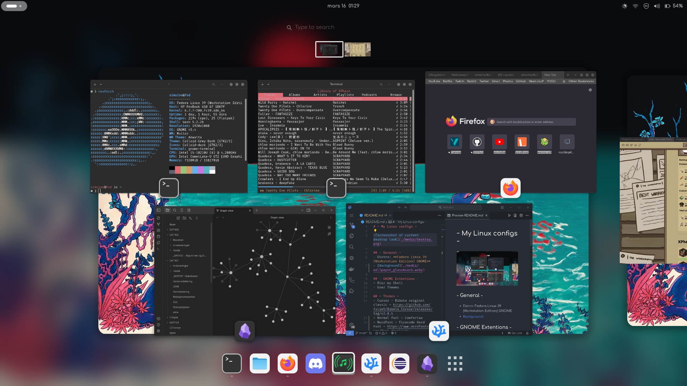

# ~ My Linux configs ~

## - General -
- Distro: **Fedora Linux 39 (Workstation Edition) GNOME**
- [Background](./media/wallpaper_firewatch.png)

## - GNOME Extentions -
- Blur my Shell
- User Themes

## - Themes -
- Cursor - Bibata original classic - https://github.com/ful1e5/Bibata_Cursor/releases/tag/v2.0.5
- Font - Firacode Nerd Font - https://www.nerdfonts.com/font-downloads
- Firefox theme - penguinFox - https://github.com/p3nguin-kun/penguinFox
- GTK theme - Colloid dgtk theme - https://github.com/vinceliuice/Colloid-gtk-theme
- Icon theme - Colloid icon theme - https://github.com/vinceliuice/Colloid-icon-theme

## - Apps -
### - Flatpak -
- Spotify client - ncspot - https://github.com/hrkfdn/ncspot
- Volume controller - PulseAudio Volume Controll - org.pulseaudio.pavucontrol
- Credential manager - Passwords and Keys - org.gnome.seahorse.Application
### - DNF -
- Screenshots - Flameshot
- Torrenting - qbittorrent
- Prompt - Starship
- User shell - fish
- IDE - VSCodium
- Media Downloader - yt-dlp + yt-dlp-fish-completion

